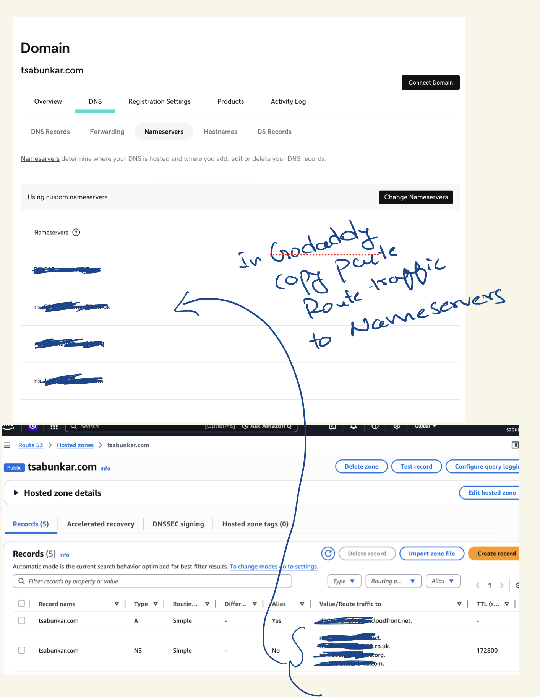

# Solutions Architect Portfolio

A production-ready, Apple-inspired portfolio for a Solutions Architect — built with **React 18 + Vite**.

## ✨ Features

- 🌙 Dark / ☀️ Light theme toggle (CSS custom properties, zero re-renders)
- 🔤 Animated word-flip hero headline
- 📱 Fully responsive — 320 px mobile → 4 K desktop
- ⚡ Scroll-triggered reveal animations via `IntersectionObserver`
- 🗂 Sections: Hero, Case Studies, Proof, About, Digital Footprint, Connect
- 🏗 Production folder structure following React best practices

## 🚀 Getting Started

```bash
# Install dependencies
npm install

# Start dev server
npm run dev

# Build for production
npm run build

# Preview production build
npm run preview
```

## 📁 Project Structure

```
src/
├── assets/         # Static data (pre-generated stars)
├── components/
│   ├── layout/     # NavBar, Footer
│   └── ui/         # ThemeToggle, SectionHeader, WordFlip, Button
├── context/        # ThemeContext (React context)
├── data/           # All copy / content (easy to edit)
├── hooks/          # useReveal, useTheme
├── sections/       # Full page sections (Hero, CaseStudies, Proof…)
├── styles/         # Global CSS, animations, utilities
├── theme/          # Theme token definitions + applyTheme()
├── App.jsx
└── main.jsx
```

## ✏️ Personalising

Edit `src/data/` files to update all copy, stats, links, and social handles.
Edit `src/theme/index.js` to change colour tokens.

## 🛠 Tech Stack

- React 18 (hooks, context, memo)
- Vite 5
- Pure CSS custom properties (no Tailwind, no CSS-in-JS)
- Zero runtime dependencies beyond React

## Deployment

- \$ terraform apply \
  -var="domain_name=tsabunkar.com" \
  -var="www_domain=www.tsabunkar.com"

## Learnings and Debugging Issues

- AWS Services Regions:
  Primary region → ap-south-1
  ACM for CloudFront → us-east-1
  CloudFront → Global
  Route 53 → Global
- Rerouting all the request from https://www.tsabunkar.com to https://tsabunkar.com during this redirection what happens at cloudfront function-
  - Detects www
  - Returns HTTP 301
  - Redirects to: https://tsabunkar.com
- Checkhow to copy the Route traffic values from Route 53 to GoDaddy Nameserver here: 
