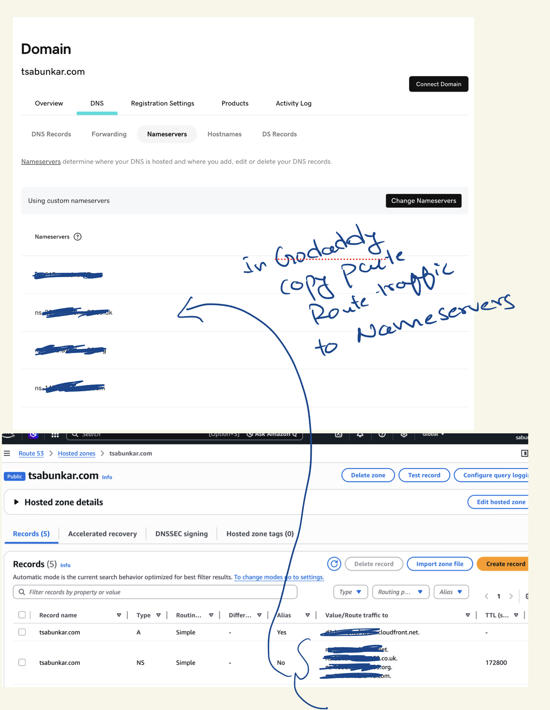

# Solutions Architect Portfolio

A production-ready, Apple-inspired portfolio for a Solutions Architect — built with **React 18 + Vite**.

## ✨ Features

- 🌙 Dark / ☀️ Light theme toggle (CSS custom properties, zero re-renders)
- 🔤 Animated word-flip hero headline
- 📱 Fully responsive — 320 px mobile → 4 K desktop
- ⚡ Scroll-triggered reveal animations via `IntersectionObserver`
- 🗂 Sections: Hero, Case Studies, Proof, About, Digital Footprint, Connect
- 🔐 **3-Factor Admin Authentication** — password + TOTP (authenticator app) + live face verification via camera
- 🎛 **Admin Control Center** — AWS cost explorer, GitHub contributions, YouTube analytics (auth-protected)
- 📄 **D&D Stories viewer** — image-to-PDF story reader with retro CRT styling
- 🏗 Production folder structure following React best practices

## 🚀 Getting Started

```bash
# Install dependencies
npm install

# Start dev server
npm run dev

# Build for production
npm run build

# Preview production build
npm run preview
```

## 📁 Project Structure

```
src/
├── assets/              # Static data (pre-generated stars)
├── components/
│   ├── layout/          # NavBar, Footer, BaseLayout, BackgroundMotion
│   └── ui/              # ThemeToggle, SectionHeader, WordFlip, Button, DogWidget
├── context/             # ThemeContext, AuthContext (JWT + 3FA)
├── data/                # All copy / content (easy to edit)
├── hooks/               # useReveal, useTheme, useSpeech, useDraggable
├── pages/
│   ├── Admin/
│   │   ├── AdminLogin.jsx          # 3FA login (password + TOTP + face)
│   │   ├── AdminDashboard.jsx      # AWS + GitHub + YouTube metrics
│   │   ├── AdminLayout.jsx         # Auth-gated layout with nav
│   │   ├── SetupTotp.jsx           # TOTP QR code generation
│   │   ├── AwsCostDashboard.jsx
│   │   ├── GithubContributions.jsx
│   │   └── YouTubeMetrics.jsx
│   ├── Home.jsx
│   └── ArticleView.jsx
├── sections/            # Full page sections (Hero, CaseStudies, Proof…)
├── styles/              # Global CSS, animations, utilities
├── theme/               # Token definitions + applyTheme()
├── App.jsx
└── main.jsx
```

## ✏️ Personalising

Edit `src/data/` files to update all copy, stats, links, and social handles.
Edit `src/theme/index.js` to change colour tokens.

## 🛠 Tech Stack

- React 18 (hooks, context, memo, lazy)
- Vite 5
- Pure CSS custom properties (no Tailwind, no CSS-in-JS)
- `react-router-dom` v7 — client-side routing with auth guards
- `recharts` — AWS cost & YouTube metrics charts
- `qrcode` — TOTP provisioning URI → QR code for authenticator apps
- `pdfjs-dist` — PDF rendering in D&D Stories viewer

## 🔐 Admin Authentication

The admin panel uses **3-factor authentication**:

1. **Knowledge** — Username + password credentials
2. **Possession** — TOTP code from an authenticator app (Google Authenticator, Authy, 1Password)
3. **Inherence** — Live face verification captured via browser camera and verified against stored biometrics

On login, the browser captures a photo (with a 3-2-1 countdown overlay), sends it to a face verification API, and only proceeds to JWT-based API login if the face matches.

### Environment Variables

| Variable | Required | Description |
|----------|----------|-------------|
| `VITE_API_URL` | ✅ | Admin API Gateway endpoint (`/login`, `/cost-explorer`, `/github-contributions`, `/youtube-metrics`, `/setup-totp`) |
| `VITE_FACE_VERIFY_URL` | ✅ | Face verification Lambda endpoint (`/verify`) |
| `GITHUB_TOKEN` | dev only | GitHub personal access token for contribution data |
| `YOUTUBE_API_KEY` | dev only | YouTube Data API key for channel metrics |

## Deployment

- \$ terraform apply \
  -var="domain_name=tsabunkar.com" \
  -var="www_domain=www.tsabunkar.com"

## Learnings and Debugging Issues

- AWS Services Regions:
  Primary region → ap-south-1
  ACM for CloudFront → us-east-1
  CloudFront → Global
  Route 53 → Global
- Rerouting all the request from https://www.tsabunkar.com to https://tsabunkar.com during this redirection what happens at cloudfront function-
  - Detects www
  - Returns HTTP 301
  - Redirects to: https://tsabunkar.com
- Checkhow to copy the Route traffic values from Route 53 to GoDaddy Nameserver here: 
